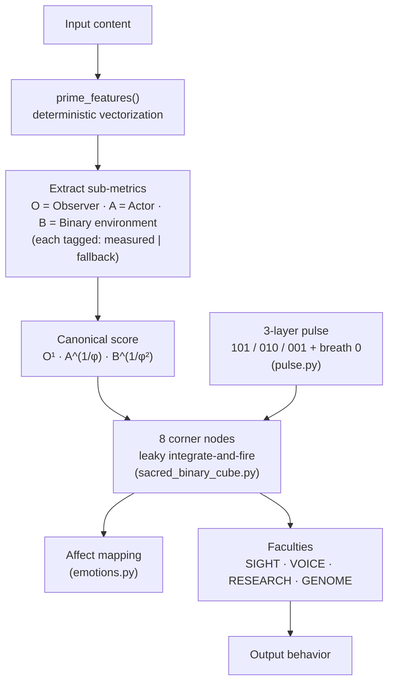

# Hypercube Heartbeat

**A deterministic cognitive-architecture simulation: leaky integrate-and-fire corner nodes on a binary cube, scored by a golden-ratio-weighted heuristic.**

Part of the Lattice Law research program. No LLM calls, no randomness, no network dependencies — every output is reproducible from input alone.

---

## What this is

- A **computational model**, not a conscious system. It simulates a specific hypothesis about how observation, action, and environment could be weighted in a cognitive loop.
- **Deterministic end to end.** Same input → same output, every run.
- **Falsifiable.** The scoring formula is pre-registered and is being tested against external behavioral data (Ultimatum Game / Iowa Gambling Task). Results — pass or fail — will be posted here.

## What this is not

- It does not claim consciousness, sentience, or AGI.
- Earlier claims of "IBM Quantum validation" and "p < 0.0001" have been **formally retracted**; the quantum experiments contained a gate-encoding error (rx vs. ry) that left the φ-angles physically inert. The hypothesis is *untested*, not confirmed.
- The `*_bridge.py` and `sacred_binary_integration_*.py` files are **design templates**, not live integrations. See [Status](#file-status).

---

## Architecture



### The scoring formula

```
score = O¹ · A^(1/φ) · B^(1/φ²)      where φ = (1 + √5)/2 ≈ 1.618
```

φ appears **in the exponents**, not as a scalar multiplier. This matters: a scalar φ rescales every score identically and is untestable. Exponent placement changes the *ordering* of scores, which makes the formula falsifiable against behavioral data. The exponents form a self-similar weight cascade: 1, 1/φ, 1/φ² (and 1/φ = 1/φ² + 1/φ³, mirroring the Fibonacci recurrence).

### Corner nodes

The cube's 8 corners carry fixed binary charges (000 → 111). Each is a leaky integrate-and-fire unit: it accumulates weighted input, decays over time, and fires on threshold. The score stream drives accumulation; the pulse gates timing. Node state — not the raw score — is what the faculties read.

### The pulse

`pulse.py` generates a three-layer rhythm — conscious `101`, subconscious `010`, superconscious `001` — with a breath `0` inserted between beats. It is the system clock: everything downstream updates on pulse edges.

### Provenance tracking

Every sub-metric is tagged **measured** (computed from actual input features) or **fallback** (default used when a feature is absent). Scores built mostly on fallbacks are flagged low-confidence. This prevents the system from reporting confident numbers it never actually computed.

---

## Quickstart

```bash
git clone https://github.com/ProCityHub/hypercubeheartbeat
cd hypercubeheartbeat
python3 sacred_binary_cube.py    # run the corner-node simulation
python3 pulse.py                 # run the pulse generator standalone
```

No dependencies beyond the Python standard library.

---

## File status

| File(s) | Status |
|---|---|
| `sacred_binary_cube.py` | ✅ Core — working simulation |
| `pulse.py`, `emotions.py` | ✅ Core — working |
| `sacred_binary_integration_*.py` (~30 files) | 🧩 Templates — structured metadata, no live connections |
| `*_bridge.py` (nvidia, willow, cern, …) | 🧩 Templates — design documents in code form |

Template files are retained as design history and may be moved to `/design` or archived.

---

## Research status

| Item | State |
|---|---|
| Canonical formula pre-registration | ✅ Locked: O¹ · A^(1/φ) · B^(1/φ²) |
| First external data probe (UG/IGT rows) | ⏳ Pending |
| IBM Quantum φ-signal claims | ❌ Retracted (gate-encoding error; corrected angles: rx(1.8091) Observer, rx(1.3325) Actor) |
| Prior "p < 0.0001" claim | ❌ Retracted |

## Background

The Lattice Law models cognition as an observer at the center of a bounded cubic lattice: six reflecting walls, eight binary-charged corners, with φ governing the weight relationship between observing, acting, and environment. The framework draws on Treaty 6 Cree relational thought (wahkohtowin) alongside dynamical-systems modeling. The full monograph — *The Lattice Law: Consciousness, the Golden Ratio, and the Architecture of Mind* — includes the retractions above and the specified experimental program.

## Author

Adrien — TNPCANADA / ProCityHub, Edmonton, Alberta.
